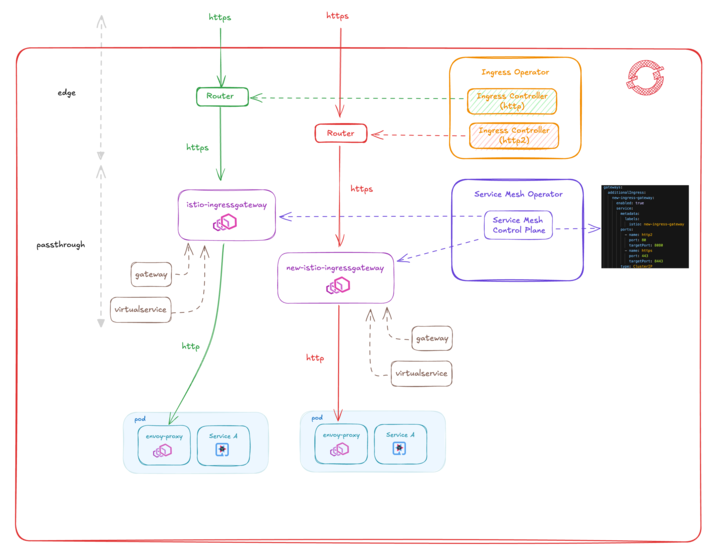

# openshift-servicemesh-bookinfo

This project shows how to apply routing using Openshift Service Mesh 2.

It also uses istio default example bookinfo service.

## Prerequisites

- OpenShift Container Platform 4.16
- Service Mesh Operator
- Kiali Operator
- Tempo Operator
- Cert Manager Operator

## Architecture Diagram

We will creat 2 "istio-ingresgateways" which will route http and https traffic to different pods.

## Related information
- https://docs.redhat.com/en/documentation/openshift_container_platform/4.16/html/service_mesh/service-mesh-2-x
- https://docs.openshift.com/container-platform/4.16/networking/ingress-operator.html#nw-http2-haproxy_configuring-ingress
- https://istio.io/latest/docs/ops/common-problems/network-issues/#404-errors-occur-when-multiple-gateways-configured-with-same-tls-certificate